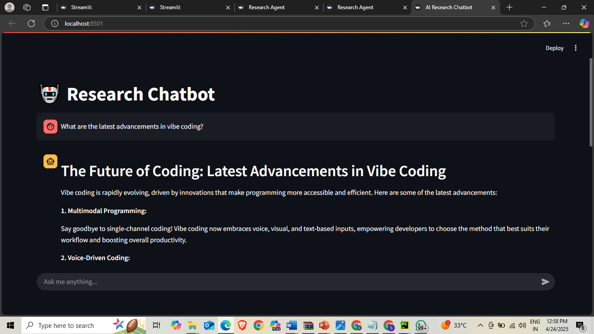
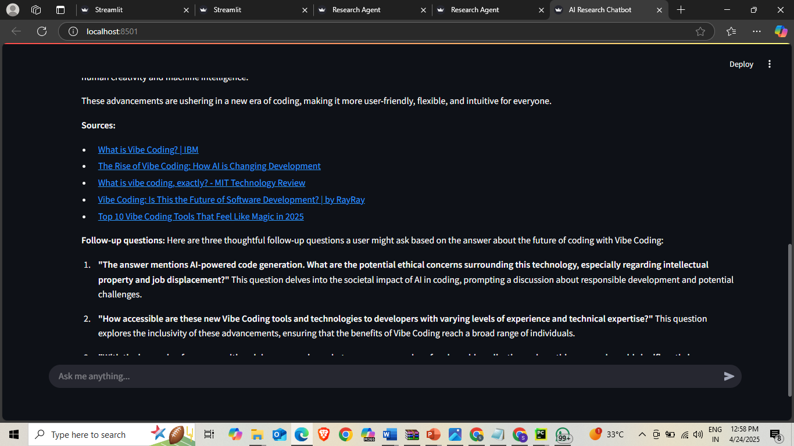

# NeuroSearch-AI-Research-Chatbot-with-Web-Intelligence
This is a smart AI-powered chatbot that allows users to perform deep research on any topic. It utilizes the **Groq LLM** for intelligent reasoning and **Tavily Search** to fetch real-time web data. The chatbot provides informative answers, clickable source links, and follow-up questions for deeper exploration.

---

## 🔧 Features

- 🧠 Understands and analyzes queries using Groq.
- 🌐 Fetches real-time search results with Tavily API.
- 📝 Extracts and summarizes content from sources.
- ✍️ Drafts and refines answers using LLM.
- 🔗 Displays clickable sources.
- ❓ Suggests follow-up questions.
- 💬 Chatbot-style UI using Streamlit.
- 🧵 Maintains chat history during the session.

---

## 🚀 Demo





---

## 📦 Tech Stack

- Python 🐍
- Streamlit
- LangGraph
- LangChain (Groq, Tavily Tools)
- Groq API
- Tavily API

---

## 📁 Setup Instructions

### 1. Clone the Repository

```bash
git clone https://github.com/your-username/ai-research-chatbot.git
cd ai-research-chatbot
```

### 2. Create a `.env` File
Inside the root folder, add your API keys to a `.env` file:

```env
TAVILY_API_KEY=your_tavily_api_key_here
GROQ_API_KEY=your_groq_api_key_here
```

### 3. Install Dependencies
We recommend using a virtual environment:

```bash
pip install -r requirements.txt
```

You may also need:

```bash
pip install streamlit langchain langchain_groq langgraph python-dotenv
```

### 4. Run the App

```bash
streamlit run app.py
```
## 🧠 How It Works

```text
User Query ➜ Query Analyzer ➜ Search via Tavily ➜ Extract Content ➜ Draft Answer via Groq ➜ Refine ➜ Display Answer + Sources + Follow-up Questions
```

* **Query Analyzer**: Parses the query into main topics and search terms.
* **Research Agent**: Uses Tavily to crawl the web and collect relevant data.
* **Content Extractor**: Extracts key information from search results.
* **Answer Drafter**: Generates a draft response using Groq's grok-beta model.
* **Answer Refiner**: Polishes the response for clarity and conciseness.
* **Streamlit UI**: Displays the final answer and handles user interaction.
